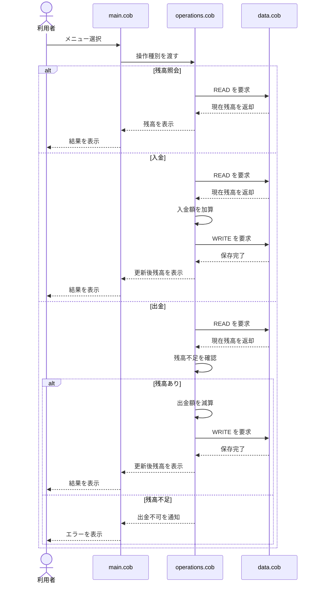

# 学校会計システムの概要

このリポジトリには、学校の会計システムを模したシンプルな COBOL ベースのプロトタイプが含まれています。現在の実装では、単一の口座残高を管理し、残高照会・入金・出金といった基本的な会計操作を行うことができます。

## 各ファイルの役割

### [src/cobol/main.cob](../src/cobol/main.cob)
目的:
- アプリケーションの起点となるファイルです。
- コンソール上でメニューを表示します。
- ユーザーの選択内容を適切な業務処理に振り分けます。

システム内での役割:
- ユーザーインターフェース層として機能します。
- メインの処理ループとプログラムの流れを管理します。

### [src/cobol/operations.cob](../src/cobol/operations.cob)
目的:
- 口座操作に関する主要な業務ロジックを実装します。
- 次の機能を提供します。
  - 現在残高の表示
  - 入金処理
  - 出金処理
- 出金時には残高不足を防ぐための判定を行います。

システム内での役割:
- アプリケーションの中核となる会計ロジックです。
- データ層への呼び出しを調整し、結果をユーザーに表示します。

### [src/cobol/data.cob](../src/cobol/data.cob)
目的:
- 口座残高の読み取りと書き込みを行う、シンプルなデータ処理を提供します。
- このプロトタイプでは、作業記憶域に残高を保持します。

システム内での役割:
- 現状の実装における軽量なデータ層として機能します。
- 残高の読み込みと保存ロジックをまとめています。

## 主な機能

- 現在の口座残高を表示する
- 口座に入金する
- 残高が十分にある場合に出金する
- 残高不足になる出金は拒否する
- シンプルなメニュー操作で利用できる

## 現在のプロトタイプで表現されている業務要件

1. 学校の会計口座に対して現在残高を保持すること。
2. 利用者が現在残高を確認できること。
3. 利用者が口座へ入金できること。
4. 利用者が口座から出金できること。
5. 残高不足の場合は出金処理を行わないこと。
6. アプリケーションが分かりやすく操作しやすい流れで動作すること。

## 補足と今後の改善点

これは簡略化したサンプル実装であり、以下のような本格的な学校会計業務にはまだ対応していません。

- 複数口座や部署ごとの管理
- 取引履歴や監査ログの保持
- 利用者認証・権限管理
- 帳票出力や照合作業
- 実運用向けの永続ストレージへの移行

これらの点は、システムを本番運用向けに近づけるために検討すべき内容です。

## データフローのシーケンス図

